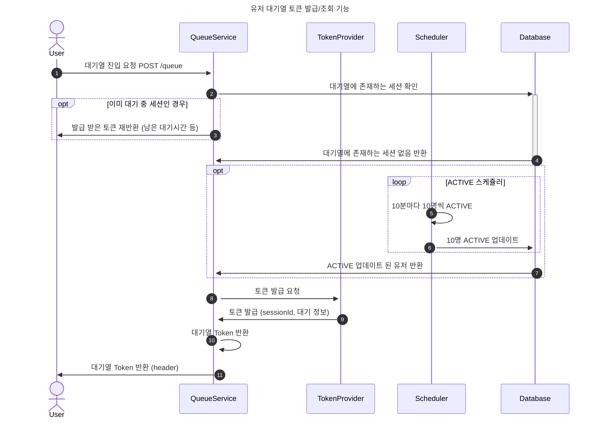
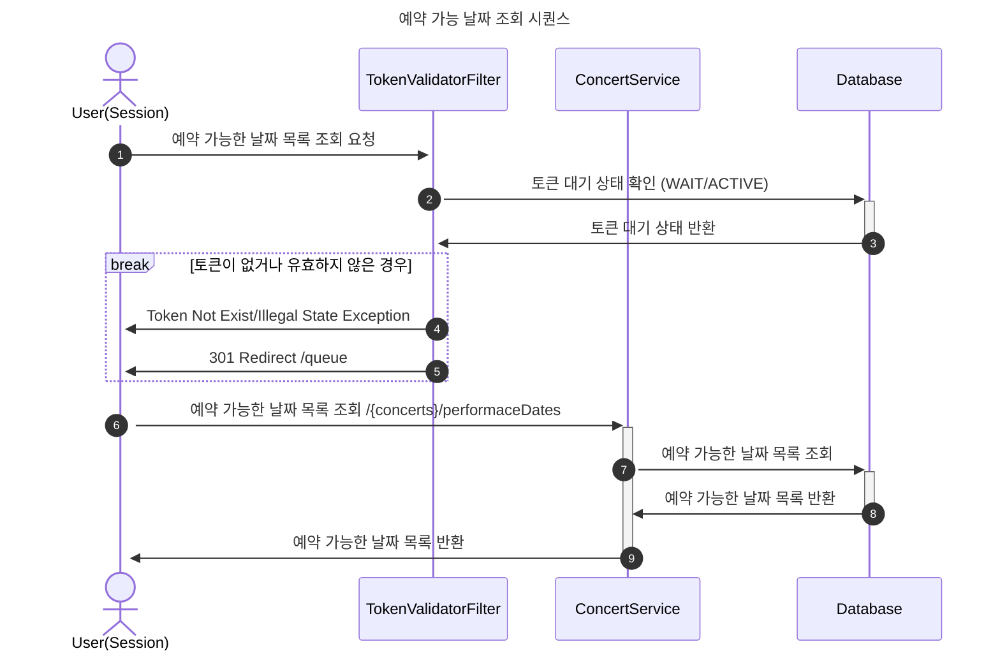
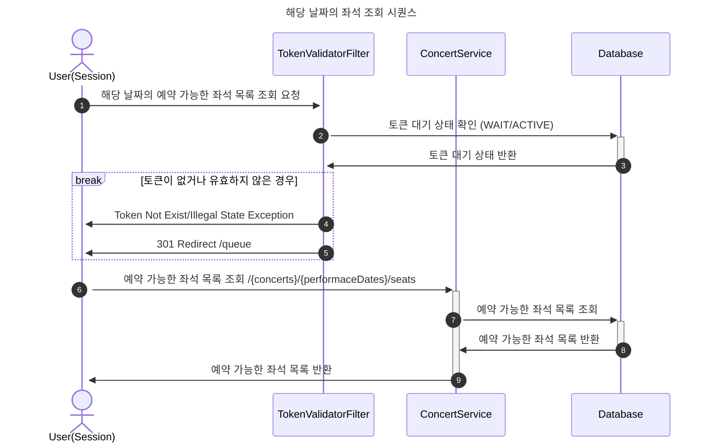
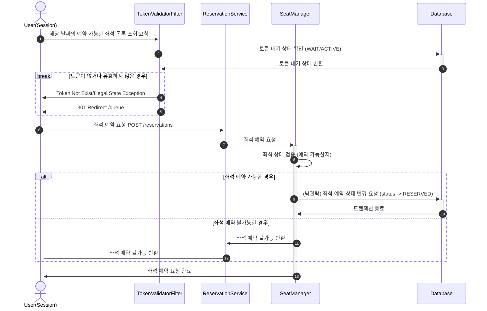
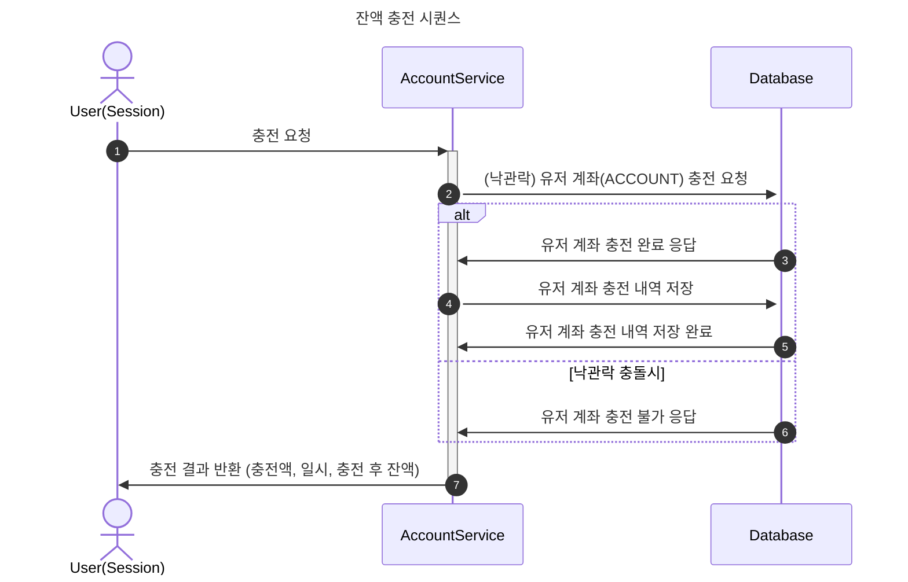
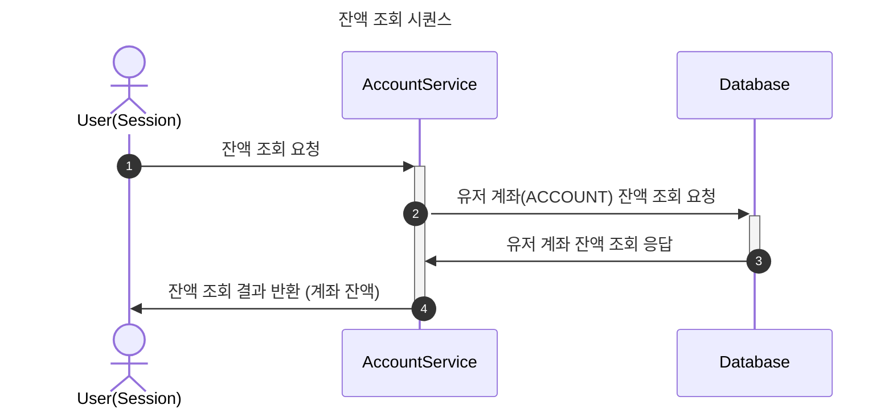
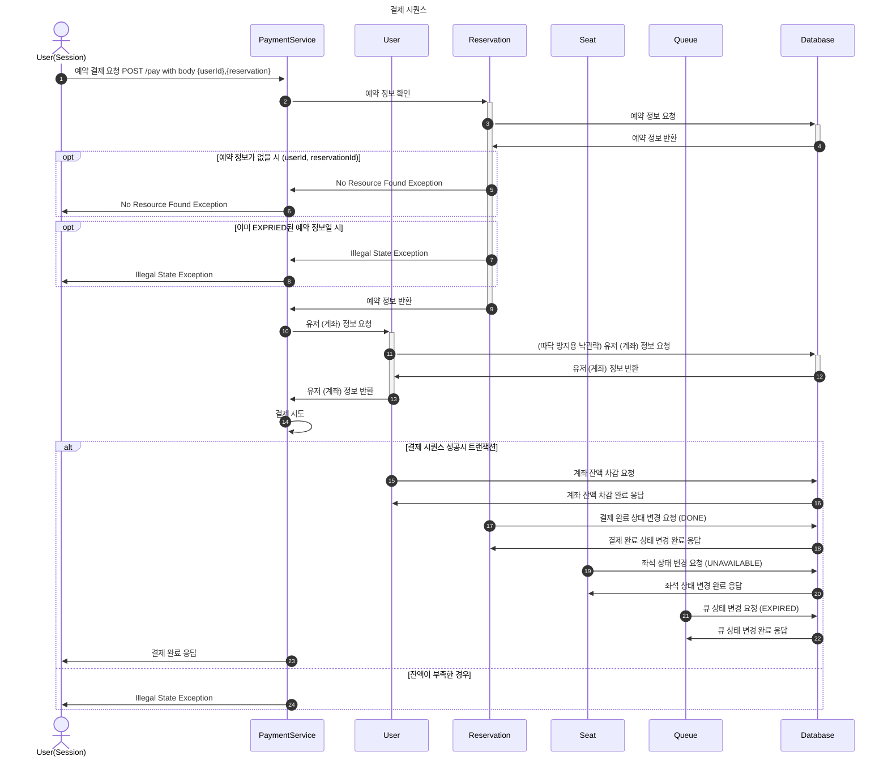

### 1. 유저 대기열 토큰 기능

```mermaid
sequenceDiagram
    autonumber
    title 유저 대기열 토큰 발급/조회 기능
    actor u as User
    participant qs as QueueService
    participant tp as TokenProvider
    participant sc as Scheduler
    participant db as Database
    u ->>+ qs: 대기열 진입 요청 POST /queue
    qs ->>+ db: 대기열에 존재하는 세션 확인
    opt 이미 대기 중 세션인 경우
        qs ->> u: 발급 받은 토큰 재반환 (남은 대기시간 등)
    end
    db ->>- qs: 대기열에 존재하는 세션 없음 반환
    opt
        loop ACTIVE 스케쥴러
            sc ->>+ sc: 10분마다 10명씩 ACTIVE
            sc ->>+ db: 10명 ACTIVE 업데이트
        end
        db ->>+ qs: ACTIVE 업데이트 된 유저 반환
    end
    qs ->>+ tp: 토큰 발급 요청 
    tp ->>+ qs: 토큰 발급 (sessionId, 대기 정보)
    qs ->> qs: 대기열 Token 반환
    qs ->> u: 대기열 Token 반환 (header)
```

### 2.  예약 가능 날짜 / 좌석 API

```mermaid

sequenceDiagram
    autonumber
    title 예약 가능 날짜 조회 시퀀스
    actor u as User(Session)
    participant tvf as TokenValidatorFilter
    participant cs as ConcertService
    participant db as Database
    u ->>+ tvf: 예약 가능한 날짜 목록 조회 요청
    tvf ->>+ db: 토큰 대기 상태 확인 (WAIT/ACTIVE)
    db ->>- tvf: 토큰 대기 상태 반환
    break 토큰이 없거나 유효하지 않은 경우
        tvf ->>+ u: Token Not Exist/Illegal State Exception
        tvf ->>+ u: 301 Redirect /queue
    end

    u ->>+ cs: 예약 가능한 날짜 목록 조회 /{concerts}/performaceDates
    cs ->>+ db: 예약 가능한 날짜 목록 조회
    db ->>- cs: 예약 가능한 날짜 목록 반환
    cs ->>- u: 예약 가능한 날짜 목록 반환
```

```mermaid
sequenceDiagram
    autonumber
    title 해당 날짜의 좌석 조회 시퀀스
    actor u as User(Session)
    participant tvf as TokenValidatorFilter
    participant cs as ConcertService
    participant db as Database

    u->>+tvf: 해당 날짜의 예약 가능한 좌석 목록 조회 요청
    tvf ->>+ db: 토큰 대기 상태 확인 (WAIT/ACTIVE)
    db ->>- tvf: 토큰 대기 상태 반환
    break 토큰이 없거나 유효하지 않은 경우
        tvf->>+u: Token Not Exist/Illegal State Exception
        tvf->>+u: 301 Redirect /queue
    end

    u->>+cs: 예약 가능한 좌석 목록 조회 /{concerts}/{performaceDates}/seats
    cs->>+db: 예약 가능한 좌석 목록 조회
    db->>-cs: 예약 가능한 좌석 목록 반환
    cs->>-u: 예약 가능한 좌석 목록 반환
```

### 3. 좌석 예약 요청 API

```mermaid
sequenceDiagram
    autonumber
    actor u as User(Session)
    participant tvf as TokenValidatorFilter
    participant rs as ReservationService
    participant sm as SeatManager
    participant db as Database
    u ->>+ tvf: 해당 날짜의 예약 가능한 좌석 목록 조회 요청
    tvf ->>+ db: 토큰 대기 상태 확인 (WAIT/ACTIVE)
    db ->>- tvf: 토큰 대기 상태 반환
    break 토큰이 없거나 유효하지 않은 경우
        tvf ->>+ u: Token Not Exist/Illegal State Exception
        tvf ->>+ u: 301 Redirect /queue
    end

    u ->>+ rs: 좌석 예약 요청 POST /reservations
    rs ->>+ sm: 좌석 예약 요청
    sm ->> sm: 좌석 상태 검증 (예약 가능한지)
    alt 좌석 예약 가능한 경우
        sm ->>+ db: (낙관락) 좌석 예약 상태 변경 요청 (status -> RESERVED)
        db ->>- sm: 트랜잭션 종료
    else 좌석 예약 불가능한 경우
        sm ->> rs: 좌석 예약 불가능 반환
        rs -> u: 좌석 예약 불가능 반환
    end
    sm ->>- u: 좌석 예약 요청 완료
```

```mermaid
sequenceDiagram
    autonumber
    title 잔액 충전 시퀀스
    actor u as User(Session)
    participant As as AccountService
    participant db as Database
    u ->>+ As: 충전 요청
    As ->>+ db: (낙관락) 유저 계좌(ACCOUNT) 충전 요청
    alt
        db ->> As: 유저 계좌 충전 완료 응답
        As ->> db: 유저 계좌 충전 내역 저장
        db ->> As: 유저 계좌 충전 내역 저장 완료
    else 낙관락 충돌시
        db ->> As: 유저 계좌 충전 불가 응답
    end
    As ->>- u: 충전 결과 반환 (충전액, 일시, 충전 후 잔액)

```

```mermaid
sequenceDiagram
    autonumber
    title 잔액 조회 시퀀스
    actor u as User(Session)
    participant As as AccountService
    participant db as Database
    u ->>+ As: 잔액 조회 요청
    As ->>+ db: 유저 계좌(ACCOUNT) 잔액 조회 요청
    db ->>- As: 유저 계좌 잔액 조회 응답
    As ->>- u: 잔액 조회 결과 반환 (계좌 잔액)

```

### 5. 결제 API

```mermaid
sequenceDiagram
    title 결제 시퀀스
    autonumber
    actor u as User(Session)
    participant ps as PaymentService
    participant um as User
    participant rm as Reservation
    participant sm as Seat
    participant qm as Queue
    participant db as Database
    u ->>+ ps: 예약 결제 요청 POST /pay with body {userId},{reservation}
    ps ->>+ rm: 예약 정보 확인
    rm ->>+ db: 예약 정보 요청
    db ->>- rm: 예약 정보 반환
    opt 예약 정보가 없을 시 (userId, reservationId)
        rm ->> ps: No Resource Found Exception
        ps ->> u: No Resource Found Exception
    end
    opt 이미 EXPRIED된 예약 정보일 시
        rm ->> ps: Illegal State Exception
        ps ->> u: Illegal State Exception
    end
    rm ->>- ps: 예약 정보 반환
    ps ->>+ um: 유저 (계좌) 정보 요청
    um ->>+ db: (따닥 방지용 낙관락) 유저 (계좌) 정보 요청
    db ->>- um: 유저 (계좌) 정보 반환
    um ->>- ps: 유저 (계좌) 정보 반환
    ps ->>+ ps: 결제 시도
    alt 결제 시퀀스 성공시 트랜잭션
        um ->> db: 계좌 잔액 차감 요청
        db ->> um: 계좌 잔액 차감 완료 응답
        rm ->> db: 결제 완료 상태 변경 요청 (DONE)
        db ->> rm: 결제 완료 상태 변경 완료 응답
        sm ->> db: 좌석 상태 변경 요청 (UNAVAILABLE)
        db ->> sm: 좌석 상태 변경 완료 응답
        qm ->> db: 큐 상태 변경 요청 (EXPIRED)
        db ->> qm: 큐 상태 변경 완료 응답
        ps ->> u: 결제 완료 응답
    else 잔액이 부족한 경우
        ps ->> u: Illegal State Exception
    end
```