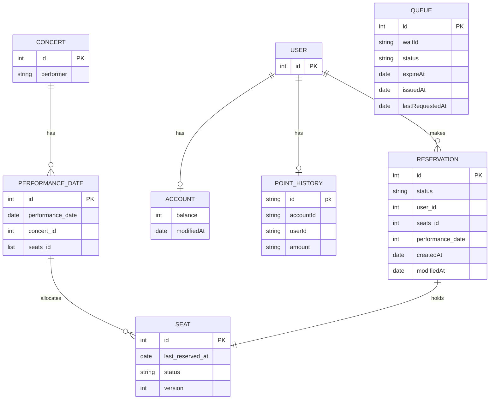

## 3. ERD

```mermaid
erDiagram
    CONCERT {
        int id PK
        string performer
    }

    PERFORMANCE_DATE {
        int id PK
        date performance_date
        int concert_id
        list seats_id
    }

    SEAT {
        int id PK
        date last_reserved_at
        string status
        int version
    }

    USER {
        int id PK
    }
    
    ACCOUNT{
        int balance
        date modifiedAt
    }
    
    QUEUE{
        int id PK
        string waitId
        string status
        date expireAt
        date issuedAt
        date lastRequestedAt
    }
    
    
    POINT_HISTORY{
        string id pk
        string accountId
        string userId
        string amount
    }

    RESERVATION {
        int id PK
        string status
        int user_id
        int seats_id
        int performance_date
        date createdAt
        date modifiedAt
    }

    CONCERT ||--o{ PERFORMANCE_DATE: "has"
    PERFORMANCE_DATE ||--o{ SEAT: "allocates"
    USER ||--o{ RESERVATION: "makes"
    USER ||--o| ACCOUNT: "has"
    USER ||--o| POINT_HISTORY: "has"
    RESERVATION ||--|| SEAT: "holds"
```