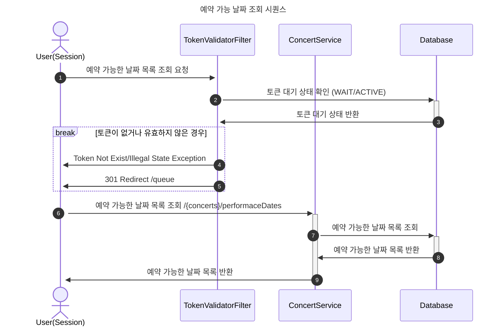
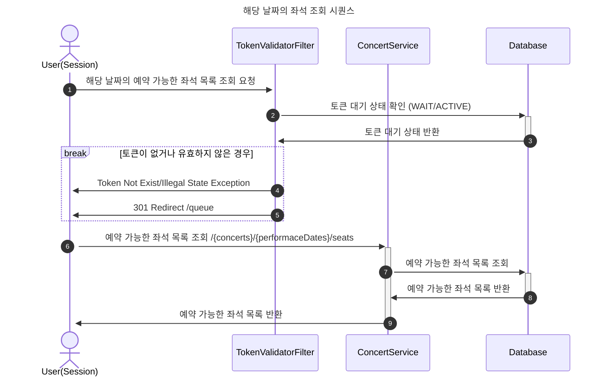

**2️⃣`기본` 예약 가능 날짜 / 좌석 API**

- 예약가능한 날짜와 해당 날짜의 좌석을 조회하는 API 를 각각 작성합니다.
- 예약 가능한 날짜 목록을 조회할 수 있습니다.
- 날짜 정보를 입력받아 예약가능한 좌석정보를 조회할 수 있습니다.

> 좌석 정보는 1 ~ 50 까지의 좌석번호로 관리됩니다.

```mermaid

sequenceDiagram
    autonumber
    title 예약 가능 날짜 조회 시퀀스
    actor u as User(Session)
    participant tvf as TokenValidatorFilter
    participant cs as ConcertService
    participant db as Database
    u ->>+ tvf: 예약 가능한 날짜 목록 조회 요청
    tvf ->>+ db: 토큰 대기 상태 확인 (WAIT/ACTIVE)
    db ->>- tvf: 토큰 대기 상태 반환
    break 토큰이 없거나 유효하지 않은 경우
        tvf ->>+ u: Token Not Exist/Illegal State Exception
        tvf ->>+ u: 301 Redirect /queue
    end

    u ->>+ cs: 예약 가능한 날짜 목록 조회 /{concerts}/performaceDates
    cs ->>+ db: 예약 가능한 날짜 목록 조회
    db ->>- cs: 예약 가능한 날짜 목록 반환
    cs ->>- u: 예약 가능한 날짜 목록 반환
```

```mermaid
sequenceDiagram
    autonumber
    title 해당 날짜의 좌석 조회 시퀀스
    actor u as User(Session)
    participant tvf as TokenValidatorFilter
    participant cs as ConcertService
    participant db as Database
    
    u->>+tvf: 해당 날짜의 예약 가능한 좌석 목록 조회 요청
    tvf ->>+ db: 토큰 대기 상태 확인 (WAIT/ACTIVE)
    db ->>- tvf: 토큰 대기 상태 반환
    break 토큰이 없거나 유효하지 않은 경우
        tvf->>+u: Token Not Exist/Illegal State Exception
        tvf->>+u: 301 Redirect /queue
    end
    
    u->>+cs: 예약 가능한 좌석 목록 조회 /{concerts}/{performaceDates}/seats
    cs->>+db: 예약 가능한 좌석 목록 조회
    db->>-cs: 예약 가능한 좌석 목록 반환
    cs->>-u: 예약 가능한 좌석 목록 반환
```