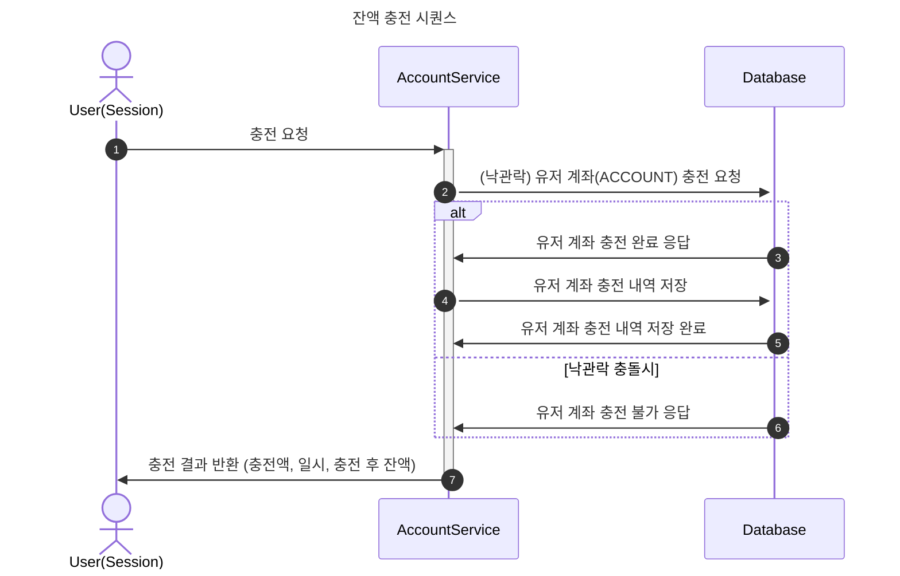
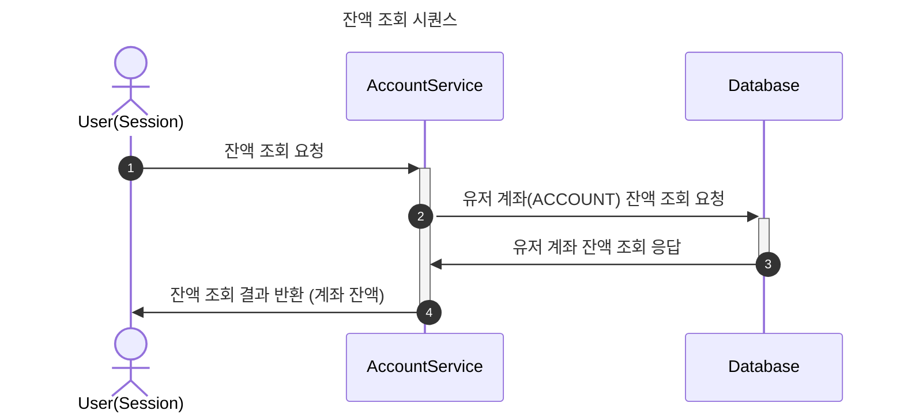

**`기본`**  **잔액 충전 / 조회 API**

- 결제에 사용될 금액을 API 를 통해 충전하는 API 를 작성합니다.
- 사용자 식별자 및 충전할 금액을 받아 잔액을 충전합니다.
- 사용자 식별자를 통해 해당 사용자의 잔액을 조회합니다.

```mermaid
sequenceDiagram
    autonumber
    title 잔액 충전 시퀀스
    actor u as User(Session)
    participant As as AccountService
    participant db as Database
    u ->>+ As: 충전 요청
    As ->>+ db: (낙관락) 유저 계좌(ACCOUNT) 충전 요청
    alt
        db ->> As: 유저 계좌 충전 완료 응답
        As ->> db: 유저 계좌 충전 내역 저장
        db ->> As: 유저 계좌 충전 내역 저장 완료
    else 낙관락 충돌시
        db ->> As: 유저 계좌 충전 불가 응답
    end
    As ->>- u: 충전 결과 반환 (충전액, 일시, 충전 후 잔액)

```

```mermaid
sequenceDiagram
    autonumber
    title 잔액 조회 시퀀스
    actor u as User(Session)
    participant As as AccountService
    participant db as Database
    u ->>+ As: 잔액 조회 요청
    As ->>+ db: 유저 계좌(ACCOUNT) 잔액 조회 요청
    db ->>- As: 유저 계좌 잔액 조회 응답
    As ->>- u: 잔액 조회 결과 반환 (계좌 잔액)

```