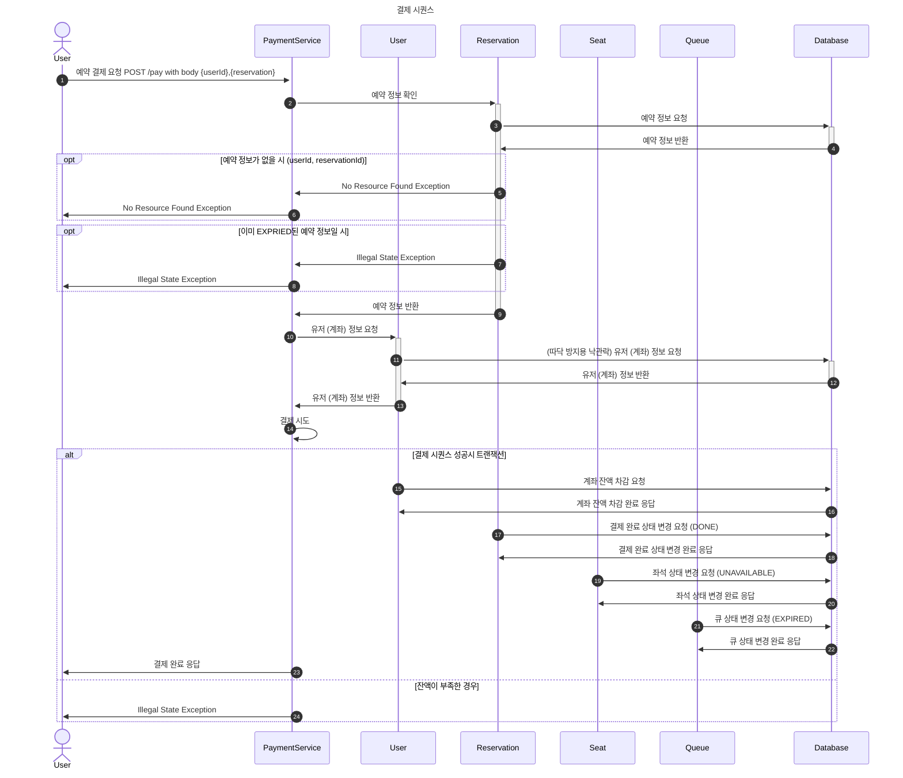

**`주요` 결제 API**

- 결제 처리하고 결제 내역을 생성하는 API 를 작성합니다.
- 결제가 완료되면 해당 좌석의 소유권을 유저에게 배정하고 대기열 토큰을 만료시킵니다.

```mermaid
sequenceDiagram
    title 결제 시퀀스
    autonumber
    actor u as User
    participant ps as PaymentService
    participant um as User
    participant rm as Reservation
    participant sm as Seat
    participant qm as Queue
    participant db as Database
    u ->>+ ps: 예약 결제 요청 POST /pay with body {userId},{reservation}
    ps ->>+ rm: 예약 정보 확인
    rm ->>+ db: 예약 정보 요청
    db ->>- rm: 예약 정보 반환
    opt 예약 정보가 없을 시 (userId, reservationId)
        rm ->> ps: No Resource Found Exception
        ps ->> u: No Resource Found Exception
    end
    opt 이미 EXPRIED된 예약 정보일 시
        rm ->> ps: Illegal State Exception
        ps ->> u: Illegal State Exception
    end
    rm ->>- ps: 예약 정보 반환
    ps ->>+ um: 유저 (계좌) 정보 요청
    um ->>+ db: (따닥 방지용 낙관락) 유저 (계좌) 정보 요청
    db ->>- um: 유저 (계좌) 정보 반환
    um ->>- ps: 유저 (계좌) 정보 반환
    ps ->>+ ps: 결제 시도
    alt 결제 시퀀스 성공시 트랜잭션
        um ->> db: 계좌 잔액 차감 요청
        db ->> um: 계좌 잔액 차감 완료 응답
        rm ->> db: 결제 완료 상태 변경 요청 (DONE)
        db ->> rm: 결제 완료 상태 변경 완료 응답
        sm ->> db: 좌석 상태 변경 요청 (UNAVAILABLE)
        db ->> sm: 좌석 상태 변경 완료 응답
        qm ->> db: 큐 상태 변경 요청 (EXPIRED)
        db ->> qm: 큐 상태 변경 완료 응답
        ps ->> u: 결제 완료 응답
    else 잔액이 부족한 경우
        ps ->> u: Illegal State Exception
    end
```