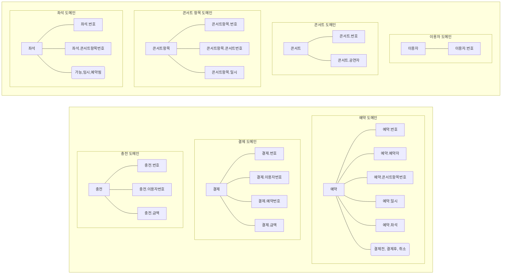

```mermaid
flowchart LR
    subgraph 1[" "]
        subgraph 이용자 도메인
            이용자 --- 이용자.번호
        end

        subgraph 콘서트 도메인
            콘서트 --- 콘서트.번호
            콘서트 --- 콘서트.공연자
        end

        subgraph 콘서트 항목 도메인
            콘서트항목 --- 콘서트항목.번호
            콘서트항목 --- 콘서트항목.콘서트번호
            콘서트항목 --- 콘서트항목.일시
        end

        subgraph 좌석 도메인
            좌석 --- 좌석.번호
            좌석 --- 좌석.콘서트항목번호
            좌석 --- 좌석.상태(가능,임시,예약됨)
        end
    end

    subgraph 2[" "]
        subgraph 예약 도메인
            예약 --- 예약.번호
            예약 --- 예약.예약자
            예약 --- 예약.콘서트항목번호
            예약 --- 예약.일시
            예약 --- 예약.좌석
            예약 --- 예약.상태(결제전, 결제후, 취소)
        end

        subgraph 결제 도메인
            결제 --- 결제.번호
            결제 --- 결제.이용자번호
            결제 --- 결제.예약번호
            결제 --- 결제.금액
        end

        subgraph 충전 도메인
            충전 --- 충전.번호
            충전 --- 충전.이용자번호
            충전 --- 충전.금액
        end
    end


```