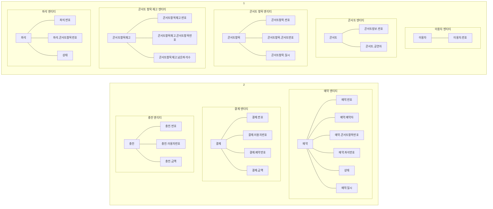

```mermaid
flowchart LR
    subgraph 1
        subgraph 이용자 엔티티
            이용자 --- 이용자.번호
        end

        subgraph 콘서트 엔티티
            콘서트 --- 콘서트정보.번호
            콘서트 --- 콘서트.공연자
        end

        subgraph 콘서트 항목 엔티티
            콘서트항목 --- 콘서트항목.번호
            콘서트항목 --- 콘서트항목.콘서트번호
            콘서트항목 --- 콘서트항목.일시
        end
        
        subgraph 콘서트 항목 재고 엔티티
            콘서트항목재고 --- 콘서트항목재고.번호
            콘서트항목재고 --- 콘서트항목재고.콘서트항목번호
            콘서트항목재고 --- 콘서트항목재고.남은좌석수
        end

        subgraph 좌석 엔티티
            좌석 --- 좌석.번호
            좌석 --- 좌석.콘서트항목번호
            좌석 --- 좌석.가능,불가능,예약중["상태"]
        end
    end

    subgraph 2
        subgraph 예약 엔티티
            예약 --- 예약.번호
            예약 --- 예약.예약자
            예약 --- 예약.콘서트항목번호
            예약 --- 예약.좌석번호
            예약 --- 예약.결제됨,결제대기중,결제취소["상태"]
            예약 --- 예약.일시
        end

        subgraph 결제 엔티티
            결제 --- 결제.번호
            결제 --- 결제.이용자번호
            결제 --- 결제.예약번호
            결제 --- 결제.금액
        end

        subgraph 충전 엔티티
            충전 --- 충전.번호
            충전 --- 충전.이용자번호
            충전 --- 충전.금액
        end
    end


```